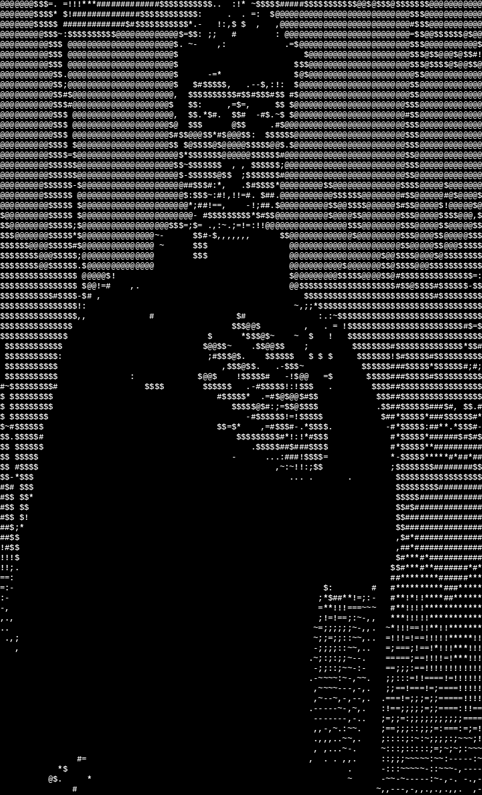

###

 

    
  
  
      

###

 

  
  
  
  
  
  
  
  
  
  
  
  
  
  

###

  <a href="https://github.com/Lu2077/Astro" style="text-decoration: none;">
    <strong>🛰️ Astro - Sat Tracking for Astronomers</strong>
  </a>

###

 

###

  <a href="https://github.com/kubeflow/sdk" style="text-decoration: none;">
    <strong>Kubeflow-sdk</strong>
  </a>

###

  

